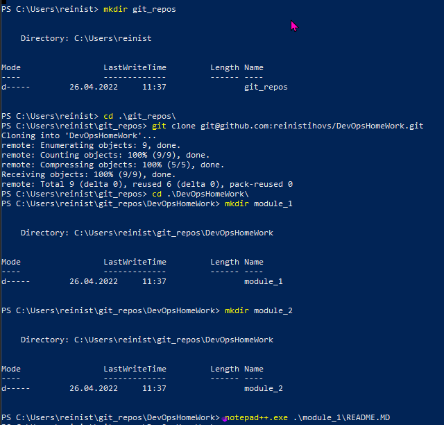

# Majasdarbs
***
Linux bash skripts, kas pasaka hello world!
# Module_1
## Module_2

## programmas palaišana.
***
* git clone https://github.com/reinistihovs/DevOpsHomeWork.git
* bash HelloWorld.sh
## Autors:
Reinis
